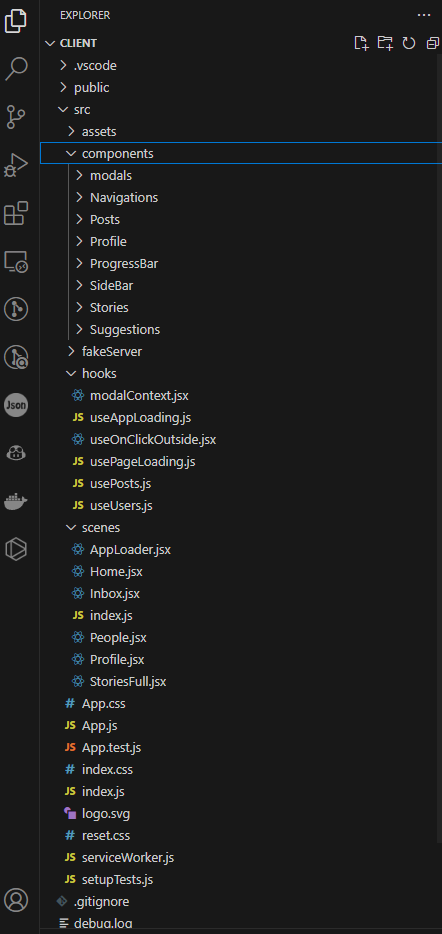
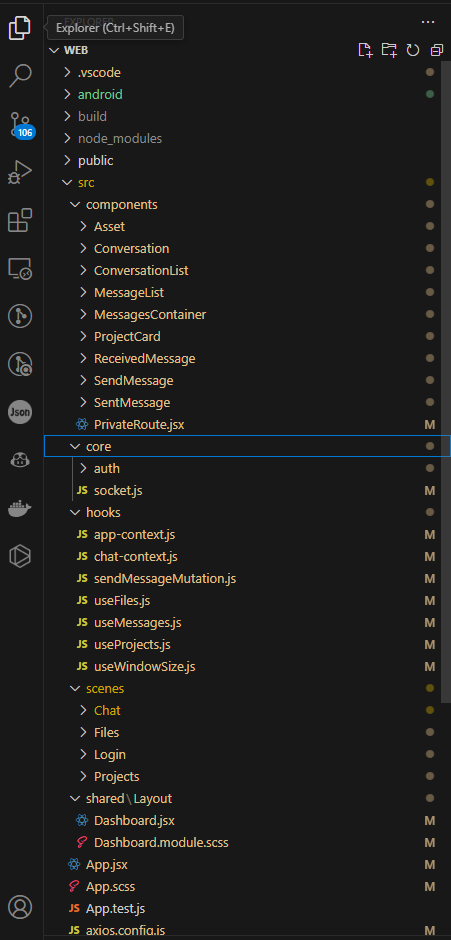
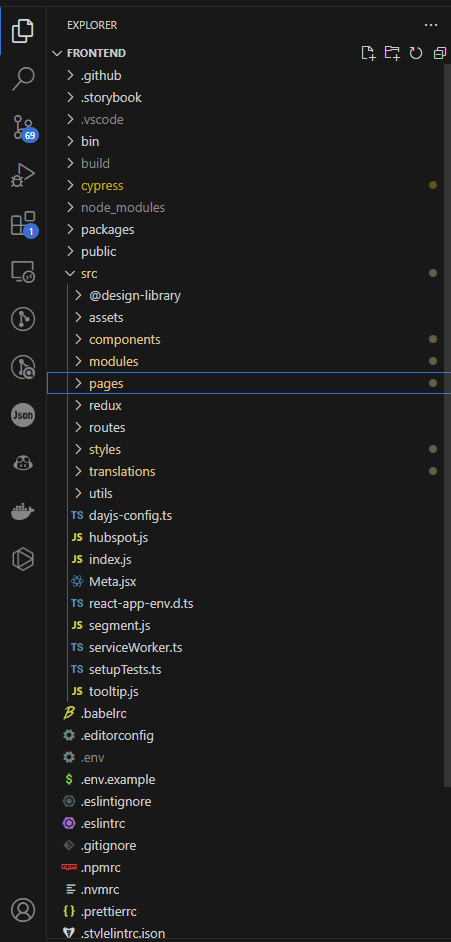

# Trello Awesomeness

## Running Instruction

1- clone the repo

2- `npm install`

To run development server : `npm run dev`

To run headless cypress tests : `npm run test`

To run cypress test through browser use this : `npx cypress open` <-- please do not choose electron as the mocking service wont work ( MSW )

## Development Story

created the branch with a vite template then created a new branch to scaffold the app and layout the structure and the tools necessary for the project initially

- changed the typescript semantic versioning from '^ minor releases' to '~ patch releases' because of a nested dependency '@typescript-eslint/typescript-estree' SUPPORTED TYPESCRIPT VERSIONS: >=4.7.4 <5.6.0
- I am keeping folder structure very simple as the required functionality is very limited and does not give me enough depth of the domain
- for the git workflow there would be 3 branches types : feature , chore , bug/hotfix and can be strict on commits using Commitizen ( not used in this repo)

### The Great Plan

before defining the steps , lets define the app scope
in a nutshell this app is a trello clone but very limited to only one board (one page) and three lists (todo , doing , done) where the user would be able to create , move and edit cards ( latest would be an extra to do it in realtime )

1- Show the lists and cards ✅

2- create todo inside a list ✅

3- edit cards title ✅

4- move todo by dragging ✅

5- open todo in a popup to edit more details ( description and labels ) ⭕

6- edit todo in realtime ( maybe only title ?) ⭕

7- work on further features/actions ( dates , checklist, comments , archived , attachments ) ? <== this were organized by priority/importance ⭕

### Notes and Progress

- note that I am writing components using jsx only as I do not need a complex type checking inside the component ,all I need is checking for props using propTypes of the component ( native react feature )

- Using redux query for the first time , it seems a good replacement for react query that I would use by default for a new project and besides the features ( caching ... etc) it does integrate smoothly with redux , however I have multiple concerns :

  - mixing both UI state and server state in redux store , let's see how it goes
  - where to put the fetching logic ? initially I would say since it belongs to redux toolkit I would put it in the store folder as slices but this is totally different layer so I would put it in a different folder called services/api

- I have just noticed that The Great Plan has flaws already , I did split features from the perspective of a developer not from the perspective of the use and have noticed that when I almost finished with first todo and started thinking about the testing ( awaking Product Engineering spirit LOL )

- I have been stuck for some time trying to intercept requests with cypress that was already mocked and I FEEL VERY STUPID , I was trying to mock api requests while they are already mocked using MSW , however I have an idea of the solution ( involves env variables ) but could not find info about it easily therefore it is either a wrong solution or a complicated/hacky solution that I would rather avoid

- I started to write cypress totally in typescript but seems an overkill maybe ? from experience it does have a steep curve to start with THEREFORE I am converting back to JS for cypress testing

- !IMPORTANT this is a note and a question to any reader , most of the times I find myself using my mental capacity more to build some logic I ll be able to navigate and hold some ideas in my mind but still wondering if there is a way to express these complex models in other form ( I am thinking in the direction of state machines ) , please let me know your way/opinion on this

- at this point I am aware that there is some ui units/components duplications however I choose to discover these while progressing instead of thinking them upfront and end up overthinking and over engineering

- OK OK , I am gonna admit it !... currently the app is coupled , state/store is coupled with the components ( the advantage here is to avoid prop drilling --- most likely this is the best because the components are not needed elsewhere the app / this is not a micro frontend / does not use react native or mobile app ) ==> Solution to refactor and introduce a new layer that separates the dumb components from smart components ( the downside of this is solution is PROP DRILLING which means passing a lot of props all over app , the advantage -- cant see it currently ? )

# Conclusion

I know I am not able to finish the requirements and I am not gonna find excuses but as a reminder for future self I did underestimate the requirements took me 2 days to take a look at trello and start and then I realized there so much work to do
in terms of complexity it is straightforward however there is a load of tasks to be done on the 7th task and I was gonna leave the realtime function the last one

I might not have demonstrated my skills fully on this app but by decomposing the frontend skills as follows

- pixel perfect ,responsive design and sleek ui : I have a live example of that https://stiftelsenfunka.org/
- realtime functionality : I have made a small app that uses socket.io to build a small chat system for design company https://github.com/ChaTbiM/hayday-staging-web
- project structure : this something I usually care about and have experienced multiple as shown below ( first 2 are from my side projects instagram clone and hayday staging , the third one is from the production app I worked on ) https://github.com/ChaTbiM/instagramClone / https://github.com/ChaTbiM/hayday-staging-web

THANK YOU FOR TAKING THE TIME TO GO THROUGH THE DOCUMENT 😄
